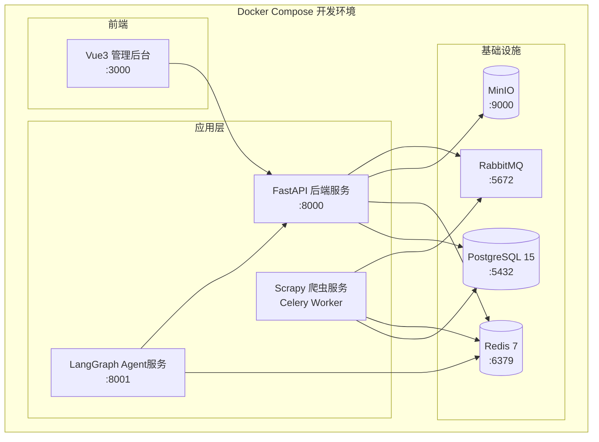

## 产品概述

基于已制定的《MVP详细开发计划-6周分阶段执行方案.md》，执行阶段一（第1周：基础架构与需求）的全部开发任务。当前工作目录为纯文档状态，零代码基础，需要从零搭建完整项目骨架。

## 核心目标

阶段一交付8项关键产出：MVP用户故事文档、系统架构设计文档、OpenAPI接口契约、数据库Schema（DDL）、LangGraph Agent编排骨架、Docker Compose开发环境、CI/CD流水线、Git分支策略与代码规范。验收标准明确要求：Docker Compose up一键启动、LangGraph骨架无import错误可执行、CI/CD自动触发lint+unit test+build、数据库核心表建表成功。

## 执行约束

全自动执行，仅5类紧急情况暂停通知：TikTok/1688 API权限问题、支付/自动下单逻辑风险、无法修复的阻塞性Bug、需求冲突、平台规则变更。所有编码、联调、测试、优化全程自动推进。每日生成极简进度简报。

## 技术栈（已确定）

- 后端：Python 3.11+ / FastAPI / SQLAlchemy 2.0 / Alembic / Celery
- Agent：LangGraph 0.2+ / LangChain
- 数据库：PostgreSQL 15+ / Redis 7+ / MinIO
- 容器：Docker / Docker Compose
- 前端：Vue 3 + TypeScript + Element Plus + Pinia + ECharts（仅脚手架）
- CI/CD：GitHub Actions
- 代码规范：Black + isort + flake8 + mypy（Python） / ESLint + Prettier（前端）

## 技术方案

### 实现策略

采用Monorepo结构管理所有服务，通过Docker Compose编排本地开发环境。后端采用模块化单体架构（Modular Monolith），MVP阶段先在同一FastAPI应用内按业务域拆分模块（product/order/fulfillment/pricing/listing/cs/finance），预留微服务拆分接口，后续按需拆分。Agent框架独立为子项目，通过内部HTTP调用与后端服务通信。

### 关键技术决策

1. **模块化单体而非纯微服务**：MVP阶段团队规模小（Agent自动化）、交付周期短（6周），模块化单体可大幅降低运维复杂度（无需K8s/服务发现/分布式事务），同时通过清晰的模块边界（Python包隔离）保证未来可拆分。
2. **SQLAlchemy 2.0 + Alembic**：ORM管理数据模型，Alembic管理数据库迁移，确保Schema版本可控。
3. **LangGraph独立进程**：Agent编排作为独立服务运行，通过FastAPI内部API与业务层交互，避免Agent框架与业务代码耦合。
4. **Mock优先**：TikTok/1688 API权限未就绪前，全部使用Mock Server模拟响应，确保开发不阻塞。

### 性能与可靠性

- 数据库连接池（SQLAlchemy pool_size=20, max_overflow=10）
- Redis缓存热数据（商品信息、会话状态），TTL策略
- Celery异步任务处理爬虫、素材生成等耗时操作
- 所有金额计算使用Decimal类型，杜绝浮点精度问题

### 架构设计



## 目录结构

```
/Users/iskywong/工作目录/project_code/
├── docker-compose.yml                    # [NEW] 开发环境编排（PG/Redis/MinIO/RabbitMQ）
├── docker-compose.dev.yml                # [NEW] 开发覆盖配置（热重载/调试端口）
├── .env.example                          # [NEW] 环境变量模板
├── .env                                  # [NEW] 本地环境变量（gitignore）
├── .gitignore                            # [NEW] Git忽略规则
├── .python-version                       # [NEW] Python版本锁定
├── Makefile                              # [NEW] 常用命令快捷方式
├── CONTRIBUTING.md                       # [NEW] 代码规范与分支策略
├── README.md                             # [NEW] 项目说明
├── docs/
│   ├── architecture.md                   # [NEW] 系统架构设计文档
│   ├── user-stories.md                   # [NEW] MVP用户故事（40-50个）
│   └── api/
│       └── openapi.yaml                  # [NEW] API接口契约（OpenAPI 3.0）
├── backend/
│   ├── Dockerfile                        # [NEW] 后端Docker镜像
│   ├── requirements.txt                  # [NEW] Python依赖
│   ├── pyproject.toml                    # [NEW] 项目配置（black/isort/mypy）
│   ├── alembic.ini                       # [NEW] 数据库迁移配置
│   ├── alembic/
│   │   ├── env.py                        # [NEW] Alembic环境配置
│   │   └── versions/
│   │       └── 001_initial_schema.py     # [NEW] 初始数据库迁移（核心表DDL）
│   ├── app/
│   │   ├── __init__.py                   # [NEW]
│   │   ├── main.py                       # [NEW] FastAPI应用入口、路由注册、CORS、生命周期
│   │   ├── config.py                     # [NEW] Pydantic Settings配置管理
│   │   ├── models/
│   │   │   ├── __init__.py               # [NEW] 模型注册
│   │   │   ├── base.py                   # [NEW] SQLAlchemy Base、公共字段（id/created_at/updated_at）
│   │   │   ├── user.py                   # [NEW] 用户/角色/权限模型（RBAC）
│   │   │   ├── product.py                # [NEW] 商品/SKU/类目/素材/供应商模型
│   │   │   ├── order.py                  # [NEW] 订单/订单项/订单状态机模型
│   │   │   ├── fulfillment.py            # [NEW] 履约/物流/1688采购单模型
│   │   │   ├── finance.py                # [NEW] 财务/对账/汇率/成本记录模型
│   │   │   └── customer_service.py       # [NEW] 客服会话/话术/工单模型
│   │   ├── api/
│   │   │   ├── __init__.py               # [NEW]
│   │   │   ├── deps.py                   # [NEW] 公共依赖（get_db/get_current_user/pagination）
│   │   │   └── v1/
│   │   │       ├── __init__.py           # [NEW]
│   │   │       ├── router.py             # [NEW] v1路由聚合
│   │   │       ├── auth.py               # [NEW] 登录/注册/Token API
│   │   │       ├── products.py           # [NEW] 商品CRUD/搜索/筛选 API
│   │   │       ├── orders.py             # [NEW] 订单查询/状态更新 API
│   │   │       ├── pricing.py            # [NEW] 成本核算/定价建议 API
│   │   │       ├── listing.py            # [NEW] TikTok上架/类目匹配 API
│   │   │       ├── fulfillment.py        # [NEW] 履约/1688下单/物流 API
│   │   │       ├── customer_service.py   # [NEW] 客服会话/工单 API
│   │   │       └── finance.py            # [NEW] 财务核算/对账 API
│   │   ├── services/
│   │   │   ├── __init__.py               # [NEW]
│   │   │   ├── product_service.py        # [NEW] 商品业务逻辑层
│   │   │   ├── order_service.py          # [NEW] 订单业务逻辑层
│   │   │   ├── pricing_service.py        # [NEW] 定价业务逻辑层
│   │   │   ├── listing_service.py        # [NEW] 上架业务逻辑层
│   │   │   ├── fulfillment_service.py    # [NEW] 履约业务逻辑层
│   │   │   ├── cs_service.py             # [NEW] 客服业务逻辑层
│   │   │   └── finance_service.py        # [NEW] 财务业务逻辑层
│   │   ├── schemas/
│   │   │   ├── __init__.py               # [NEW]
│   │   │   ├── common.py                 # [NEW] 通用Schema（Pagination/Response）
│   │   │   ├── product.py                # [NEW] 商品Pydantic Schema
│   │   │   ├── order.py                  # [NEW] 订单Pydantic Schema
│   │   │   ├── auth.py                   # [NEW] 认证Pydantic Schema
│   │   │   └── finance.py                # [NEW] 财务Pydantic Schema
│   │   └── core/
│   │       ├── __init__.py               # [NEW]
│   │       ├── database.py               # [NEW] 数据库连接/会话管理
│   │       ├── redis.py                  # [NEW] Redis连接管理
│   │       ├── security.py               # [NEW] JWT鉴权/密码哈希
│   │       └── exceptions.py             # [NEW] 自定义异常/全局异常处理
│   ├── tests/
│   │   ├── __init__.py                   # [NEW]
│   │   ├── conftest.py                   # [NEW] 测试 fixtures（测试DB/客户端/Mock）
│   │   ├── test_health.py                # [NEW] 健康检查冒烟测试
│   │   ├── test_products.py              # [NEW] 商品CRUD单元测试
│   │   └── test_auth.py                  # [NEW] 认证流程单元测试
│   └── scripts/
│       └── seed_data.py                  # [NEW] Mock测试数据种子脚本
├── agent/
│   ├── Dockerfile                        # [NEW] Agent服务Docker镜像
│   ├── requirements.txt                  # [NEW] Agent Python依赖
│   ├── app/
│   │   ├── __init__.py                   # [NEW]
│   │   ├── main.py                       # [NEW] Agent服务入口（FastAPI封装）
│   │   ├── config.py                     # [NEW] Agent配置
│   │   ├── agents/
│   │   │   ├── __init__.py               # [NEW] Agent注册表
│   │   │   ├── master.py                 # [NEW] Master Agent（全局调度）
│   │   │   ├── selection.py              # [NEW] 选品Agent
│   │   │   ├── material.py               # [NEW] 素材Agent
│   │   │   ├── pricing.py                # [NEW] 定价Agent
│   │   │   ├── listing.py                # [NEW] 上架Agent
│   │   │   ├── fulfillment.py            # [NEW] 履约Agent
│   │   │   ├── customer_service.py       # [NEW] 客服Agent
│   │   │   └── finance.py                # [NEW] 财务Agent
│   │   ├── graph/
│   │   │   ├── __init__.py               # [NEW]
│   │   │   ├── workflow.py               # [NEW] LangGraph主工作流图定义
│   │   │   ├── state.py                  # [NEW] 图状态类型定义（TypedDict）
│   │   │   └── nodes.py                  # [NEW] 图节点函数
│   │   ├── tools/
│   │   │   ├── __init__.py               # [NEW]
│   │   │   ├── backend_tools.py          # [NEW] 调用后端API的Tool封装
│   │   │   ├── tiktok_tools.py           # [NEW] TikTok API Tool（Mock版）
│   │   │   └── alibaba_tools.py          # [NEW] 1688 API Tool（Mock版）
│   │   └── prompts/
│   │       ├── __init__.py               # [NEW]
│   │       └── system_prompts.py         # [NEW] 各Agent System Prompt定义
│   └── tests/
│       ├── __init__.py                   # [NEW]
│       └── test_workflow.py              # [NEW] Agent工作流单元测试
├── scraper/
│   ├── Dockerfile                        # [NEW] 爬虫Docker镜像
│   ├── requirements.txt                  # [NEW] 爬虫Python依赖
│   ├── scrapy.cfg                        # [NEW] Scrapy配置
│   └── scraper/
│       ├── __init__.py                   # [NEW]
│       ├── items.py                      # [NEW] 商品数据Item定义
│       ├── middlewares.py                 # [NEW] 反爬中间件（UA/代理/频率）
│       ├── pipelines.py                  # [NEW] 数据清洗入库Pipeline
│       ├── settings.py                   # [NEW] Scrapy配置
│       └── spiders/
│           ├── __init__.py               # [NEW]
│           └── alibaba.py                # [NEW] 1688商品爬虫（骨架）
├── frontend/
│   ├── package.json                      # [NEW] 前端依赖（Vue3+ElementPlus）
│   ├── vite.config.ts                    # [NEW] Vite配置（代理后端API）
│   ├── tsconfig.json                     # [NEW] TypeScript配置
│   ├── .eslintrc.cjs                     # [NEW] ESLint配置
│   ├── .prettierrc                       # [NEW] Prettier配置
│   ├── index.html                        # [NEW] HTML入口
│   └── src/
│       ├── main.ts                       # [NEW] Vue应用入口
│       ├── App.vue                       # [NEW] 根组件
│       ├── router/
│       │   └── index.ts                  # [NEW] 路由定义骨架
│       ├── stores/
│       │   └── user.ts                   # [NEW] 用户状态管理
│       ├── api/
│       │   ├── request.ts                # [NEW] Axios封装（拦截器/Token）
│       │   └── index.ts                  # [NEW] API模块导出
│       ├── views/
│       │   ├── LoginView.vue             # [NEW] 登录页骨架
│       │   └── DashboardView.vue         # [NEW] 仪表盘页骨架
│       ├── layouts/
│       │   └── DefaultLayout.vue         # [NEW] 默认布局（侧边栏+顶栏）
│       └── components/
│           └── common/                   # [NEW] 通用组件目录
├── .github/
│   └── workflows/
│       ├── ci.yml                        # [NEW] CI流水线（lint/test/build）
│       └── deploy-dev.yml                # [NEW] 开发环境自动部署
└── infra/
    └── postgres/
        └── init.sql                      # [NEW] PostgreSQL初始化脚本
```

## 关键代码结构

### 配置管理（app/config.py）

使用Pydantic BaseSettings管理环境变量配置，支持.env文件加载。包含数据库URL、Redis URL、JWT密钥、TikTok/1688 API配置（Mock模式开关）、LLM模型配置等。

### 数据库基类（app/models/base.py）

SQLAlchemy 2.0声明式基类，包含id（UUID主键）、created_at、updated_at三个公共字段，所有业务模型继承此类。使用Mapped类型注解。

### LangGraph状态定义（agent/graph/state.py）

使用TypedDict定义Agent工作流状态结构，包含：task_type、product_data、material_data、pricing_data、listing_result、order_data、fulfillment_data、messages（Agent间通信）、current_agent等字段。

### LangGraph工作流（agent/graph/workflow.py）

使用StateGraph定义主工作流：START -> master_agent -> [条件分支: selection/listing/fulfillment] -> 各业务Agent -> END。条件分支基于state.task_type决定路由。

## Agent Extensions

### SubAgent

- **code-explorer**
- Purpose: 在生成大量文件前，用于验证现有代码库结构和文件依赖关系
- Expected outcome: 确认工作目录当前状态，确保新建文件不与现有文件冲突
- **research_subagent**
- Purpose: 并行执行独立开发任务，如后端骨架开发、前端脚手架搭建、文档编写
- Expected outcome: 多个子代理并行产出代码文件，由总控Agent汇总验证