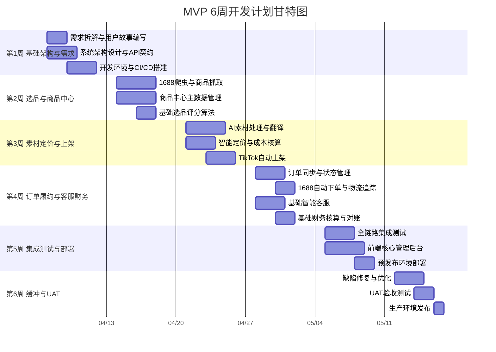
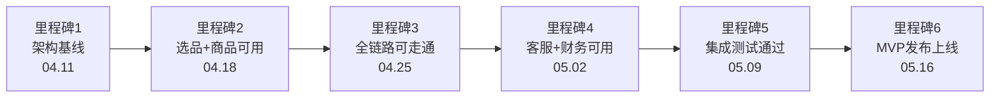

# TikTok跨境电商全自动运营系统 MVP详细开发计划

**文档版本**: V1.0
**创建日期**: 2025-04-02
**总周期**: 6周（5周开发 + 1周缓冲）
**适用范围**: MVP核心闭环（选品→上架→订单→履约→客服→财务）

---

## 一、计划总览

### 总体时间分配

| 阶段 | 周次 | 时间 | 工作天数 | 核心目标 |
|------|------|------|---------|---------|
| 阶段一 | 第1周 | 04.07 - 04.11 | 5天 | 基础架构搭建与需求拆解 |
| 阶段二 | 第2周 | 04.14 - 04.18 | 5天 | 选品与商品中心开发 |
| 阶段三 | 第3周 | 04.21 - 04.25 | 5天 | 素材定价与商品上架 |
| 阶段四 | 第4周 | 04.28 - 05.02 | 5天 | 订单履约与客服财务 |
| 阶段五 | 第5周 | 05.05 - 05.09 | 5天 | 集成测试与部署优化 |
| 阶段六 | 第6周 | 05.12 - 05.16 | 5天 | 缓冲、UAT与发布 |

### Agent角色与阶段负责人映射

| 阶段 | 主要负责人 | 协同角色 | 人工审批点 |
|------|-----------|---------|-----------|
| 阶段一 | 架构师Agent + DevOps Agent | 产品经理Agent | 技术选型(P1)、架构方案(P1) |
| 阶段二 | 后端Agent-Core + AI/算法Agent | 架构师Agent | 爬虫策略(P2)、数据模型(P2) |
| 阶段三 | 后端Agent-Core + 后端Agent-Marketing | AI/算法Agent | 定价规则(P1)、上架策略(P2) |
| 阶段四 | 后端Agent-Core + 后端Agent-Support | 测试Agent | 财务规则(P1)、客服话术(P2) |
| 阶段五 | 测试Agent + DevOps Agent + 前端开发Agent | 全部Agent | 部署发布(P0)、质量门禁(P1) |
| 阶段六 | 产品经理Agent + 测试Agent | 全部Agent | UAT验收(P1)、发布审批(P0) |

---

## 二、阶段一：基础架构与需求（第1周）

**时间**：04.07（周一）- 04.11（周五），共5个工作日
**阶段负责人**：架构师Agent（主导）、产品经理Agent（协同）、DevOps Agent（协同）

### 2.1 交付物清单

| 交付物 | 负责Agent | 完成时间 | 产出格式 |
|--------|----------|---------|---------|
| MVP用户故事拆解（约40-50个Story） | 产品经理Agent | 周二18:00 | Markdown文档 + Jira Epic/Story |
| 系统架构设计文档（含微服务拆分方案） | 架构师Agent | 周三18:00 | Markdown + Mermaid架构图 |
| API接口契约文档（OpenAPI 3.0规范） | 架构师Agent | 周四12:00 | YAML/JSON格式 |
| 数据库Schema设计（核心表结构） | 架构师Agent | 周四18:00 | SQL DDL脚本 |
| LangGraph Agent编排骨架代码 | 架构师Agent | 周五12:00 | Python代码 |
| 开发环境搭建（Docker Compose） | DevOps Agent | 周二18:00 | docker-compose.yml |
| CI/CD流水线配置 | DevOps Agent | 周三18:00 | Jenkinsfile/GitHub Actions YAML |
| Git分支策略与代码规范 | 架构师Agent | 周一18:00 | CONTRIBUTING.md |

### 2.2 任务分解

**Day 1（周一）- 需求对齐与环境准备**

| 任务 | 负责Agent | 工时 | 依赖 |
|------|----------|------|------|
| MVP需求范围确认与优先级排序 | 产品经理Agent | 3h | PRD文档 |
| 用户故事拆解（第一批：选品+商品+上架） | 产品经理Agent | 4h | PRD文档 |
| Git仓库初始化与分支策略 | DevOps Agent | 1h | 无 |
| 代码规范制定（linting/formatting） | DevOps Agent | 2h | 无 |

**Day 2（周二）- 架构设计与环境搭建**

| 任务 | 负责Agent | 工时 | 依赖 |
|------|----------|------|------|
| 用户故事拆解（第二批：订单+履约+客服+财务） | 产品经理Agent | 4h | Day 1 |
| 微服务拆分方案设计 | 架构师Agent | 4h | PRD文档 |
| Docker Compose开发环境 | DevOps Agent | 3h | 无 |
| PostgreSQL + Redis + MinIO搭建 | DevOps Agent | 2h | Docker环境 |

**Day 3（周三）- API设计与CI/CD**

| 任务 | 负责Agent | 工时 | 依赖 |
|------|----------|------|------|
| 数据库Schema设计（核心表） | 架构师Agent | 4h | Day 2架构 |
| API接口设计（选品+商品+上架） | 架构师Agent | 3h | Day 2架构 |
| CI/CD流水线配置 | DevOps Agent | 3h | Git仓库 |
| LangGraph项目骨架搭建 | 架构师Agent | 2h | Day 2架构 |

**Day 4（周四）- 接口完善与Agent编排**

| 任务 | 负责Agent | 工时 | 依赖 |
|------|----------|------|------|
| API接口设计（订单+履约+客服+财务） | 架构师Agent | 4h | Day 3 |
| LangGraph Agent编排骨架 | 架构师Agent | 3h | Day 3骨架 |
| FastAPI项目脚手架生成 | 架构师Agent | 2h | Day 3 |
| 第三方API对接准备（TikTok/1688 SDK） | 后端Agent-Core | 2h | API文档 |

**Day 5（周五）- 阶段评审与基线**

| 任务 | 负责Agent | 工时 | 依赖 |
|------|----------|------|------|
| 验收标准细化（量化指标） | 测试Agent | 3h | 用户故事 |
| 架构评审会议 | 架构师Agent + 产品经理Agent | 2h | 全部产出 |
| 开发环境冒烟测试 | DevOps Agent | 1h | Docker环境 |
| Sprint Planning（第2周） | 全部Agent | 2h | 阶段一交付物 |

### 2.3 依赖项

| 依赖类型 | 依赖项 | 获取方式 | 风险等级 |
|---------|--------|---------|---------|
| 外部服务 | TikTok Shop开发者账号（沙箱环境） | 人类CTO提供 | 高 |
| 外部服务 | 1688开放平台开发者权限 | 人类CTO提供 | 高 |
| 基础设施 | 云服务器（开发/测试环境） | DevOps Agent申请 | 中 |
| AI服务 | GPT-4o / Claude API Key | 人类CTO提供 | 低 |
| 开发工具 | LangGraph/LangChain框架 | 开源安装 | 低 |

### 2.4 风险与应对

| 风险 | 概率 | 影响 | 应对措施 |
|------|------|------|---------|
| TikTok沙箱环境申请延迟 | 中 | 高 | Day 1同步申请；备选：使用Mock数据先行开发，Mock Server模拟API |
| 架构决策分歧 | 低 | 中 | 架构师Agent提出方案，人类CTO在Day 5前审批确认；备选：采用已验证的Spring Cloud微服务方案 |
| 第三方API文档不完整 | 高 | 中 | 预留API研究时间；架构师Agent对接前先做API PoC验证 |
| Docker环境兼容问题 | 低 | 低 | DevOps Agent使用标准镜像，提前在本地验证 |

### 2.5 验收标准（可量化、可测试）

| 验收项 | 量化标准 | 验证方法 | 验证人 |
|--------|---------|---------|--------|
| 用户故事覆盖度 | 100%覆盖MVP 10大模块核心功能 | 清单对照PRD模块 | 产品经理Agent |
| API接口定义 | 所有核心接口均有OpenAPI规范，覆盖率100% | Swagger UI可访问 | 架构师Agent |
| 数据库Schema | 核心表（商品、订单、SKU、用户）全部建表成功 | psql连接验证，\dt确认 | 后端Agent-Core |
| 开发环境 | Docker Compose up一键启动，所有服务healthy | docker-compose ps | DevOps Agent |
| CI/CD流水线 | 代码push自动触发lint+unit test+build | 模拟push验证 | DevOps Agent |
| LangGraph骨架 | Agent编排图可执行，无import错误 | python main.py --dry-run | 架构师Agent |
| 分支策略 | Git Flow分支模型就绪，保护规则生效 | 尝试直接push master被拒 | DevOps Agent |

---

## 三、阶段二：选品与商品中心（第2周）

**时间**：04.14（周一）- 04.18（周五），共5个工作日
**阶段负责人**：后端Agent-Core（主导）、AI/算法Agent（协同）

### 3.1 交付物清单

| 交付物 | 负责Agent | 完成时间 | 产出格式 |
|--------|----------|---------|---------|
| 1688商品抓取爬虫（Scrapy） | 后端Agent-Core | 周四18:00 | Python Scrapy项目 |
| IP代理池管理模块 | 后端Agent-Core | 周三18:00 | Python模块 |
| 商品中心CRUD API（FastAPI） | 后端Agent-Core | 周四18:00 | REST API |
| 商品主数据模型与存储 | 后端Agent-Core | 周二18:00 | PostgreSQL表+ORM |
| AI选品评分算法V1 | AI/算法Agent | 周五12:00 | Python模型+API |
| 商品数据Mock（1000条测试数据） | 测试Agent | 周一18:00 | SQL种子数据 |
| 爬虫单元测试（覆盖率>=80%） | 后端Agent-Core | 周五18:00 | PyTest用例 |

### 3.2 任务分解

**Day 1（周一）- 商品数据模型与Mock数据**

| 任务 | 负责Agent | 工时 | 依赖 |
|------|----------|------|------|
| 商品主数据表设计与ORM（Product/SKU/Category） | 后端Agent-Core | 3h | 阶段一Schema |
| 商品中心基础CRUD API | 后端Agent-Core | 3h | 数据模型 |
| Mock测试数据生成（1000条商品） | 测试Agent | 2h | 数据模型 |

**Day 2（周二）- 1688爬虫核心开发**

| 任务 | 负责Agent | 工时 | 依赖 |
|------|----------|------|------|
| Scrapy爬虫框架搭建（目录结构+中间件） | 后端Agent-Core | 2h | 开发环境 |
| 1688商品列表页爬取（按关键词/类目） | 后端Agent-Core | 4h | Scrapy框架 |
| 商品详情页数据解析（价格/SKU/图片/描述） | 后端Agent-Core | 3h | 列表页爬虫 |
| 商品中心API完善（搜索/过滤/分页） | 后端Agent-Core | 2h | Day 1 CRUD |

**Day 3（周三）- 反爬策略与代理池**

| 任务 | 负责Agent | 工时 | 依赖 |
|------|----------|------|------|
| IP代理池管理模块（轮换/健康检测） | 后端Agent-Core | 3h | 爬虫框架 |
| 反爬机制适配（请求频率/UA轮换/Cookie管理） | 后端Agent-Core | 3h | 爬虫框架 |
| 数据去重与增量同步逻辑 | 后端Agent-Core | 2h | 爬虫核心 |
| 选品评分算法设计（维度：销量/利润率/竞争度/趋势） | AI/算法Agent | 3h | 无 |

**Day 4（周四）- 集成与优化**

| 任务 | 负责Agent | 工时 | 依赖 |
|------|----------|------|------|
| 爬虫→商品中心数据入库流程 | 后端Agent-Core | 3h | 爬虫+商品API |
| 断点续爬与任务状态管理 | 后端Agent-Core | 2h | 爬虫核心 |
| 选品评分算法实现（规则引擎+权重计算） | AI/算法Agent | 4h | Day 3设计 |
| 爬虫监控仪表板（抓取数/成功率/反爬率） | DevOps Agent | 2h | 爬虫运行 |

**Day 5（周五）- 测试与集成**

| 任务 | 负责Agent | 工时 | 依赖 |
|------|----------|------|------|
| 爬虫单元测试与集成测试 | 后端Agent-Core | 3h | 爬虫开发完成 |
| 选品算法测试（历史数据回测） | AI/算法Agent | 2h | 算法实现 |
| 商品中心API测试（Postman自动化） | 测试Agent | 2h | 商品API |
| 与阶段一LangGraph骨架集成 | 架构师Agent | 2h | 爬虫+商品+算法 |

### 3.3 依赖项

| 依赖类型 | 依赖项 | 来源 | 风险 |
|---------|--------|------|------|
| 外部API | 1688开放平台API（商品搜索/详情） | 人类CTO提供 | 高 |
| 外部服务 | IP代理池服务（>=100个IP） | 采购/自建 | 中 |
| 内部依赖 | 阶段一数据库Schema | 阶段一交付 | 低 |
| 内部依赖 | 阶段一Docker环境 | 阶段一交付 | 低 |

### 3.4 风险与应对

| 风险 | 概率 | 影响 | 应对措施 |
|------|------|------|---------|
| 1688反爬策略升级导致抓取失败 | 高 | 高 | 多层反爬适配（UA+IP+频率）；备选：对接1688官方API（数据接口） |
| IP代理池质量差 | 中 | 中 | 多代理供应商；自建住宅IP池；失败自动切换 |
| 商品数据解析规则变更 | 中 | 中 | CSS选择器+XPath双路径解析；结构变更告警机制 |
| 评分算法准确率不达标 | 中 | 低 | 先用规则引擎V1，后续迭代AI模型；降低MVP阶段评分精度要求 |

### 3.5 验收标准（可量化、可测试）

| 验收项 | 量化标准 | 验证方法 | 验证人 |
|--------|---------|---------|--------|
| 抓取覆盖率 | 目标品类商品抓取覆盖率>=85%（MVP阶段降低至85%） | 5个品类x3关键词，统计抓取结果 | 测试Agent |
| 数据准确率 | 价格/SKU/库存数据准确率>=95% | 抽样100条，与1688页面对比 | 测试Agent |
| 反爬拦截率 | 反爬拦截率<15%（MVP阶段放宽至15%） | 连续运行1小时，统计拦截次数 | 测试Agent |
| 商品中心API | CRUD操作响应时间<200ms（P95） | Postman压测100次取P95 | 测试Agent |
| 数据完整性 | 必填字段完整率>=95% | SELECT COUNT验证空值比例 | 测试Agent |
| 选品评分 | 评分算法可运行，输出0-100分 | 输入100条商品数据验证 | AI/算法Agent |
| 代码覆盖率 | 爬虫+商品模块单元测试覆盖率>=80% | pytest-cov报告 | DevOps Agent |

---

## 四、阶段三：素材定价与上架（第3周）

**时间**：04.21（周一）- 04.25（周五），共5个工作日
**阶段负责人**：后端Agent-Core（主导）、后端Agent-Marketing（协同）、AI/算法Agent（协同）

### 4.1 交付物清单

| 交付物 | 负责Agent | 完成时间 | 产出格式 |
|--------|----------|---------|---------|
| AI图片翻译与文字重绘服务 | AI/算法Agent | 周三18:00 | Python服务+API |
| 基础素材原创化处理（背景替换/水印去除） | AI/算法Agent | 周四18:00 | Python模块+API |
| 全成本核算引擎 | 后端Agent-Core | 周二18:00 | Python计算模块 |
| 智能定价算法V1（成本+利润率+竞品对标） | AI/算法Agent | 周三18:00 | Python模型+API |
| TikTok Shop商品上架API对接 | 后端Agent-Core | 周四18:00 | Python SDK封装 |
| 自动上架流程（选品→素材→定价→上架） | 后端Agent-Core | 周五12:00 | LangGraph Workflow |
| 商品本地化翻译（标题/描述/卖点） | 后端Agent-Marketing | 周四18:00 | Python翻译模块 |

### 4.2 任务分解

**Day 1（周一）- 成本核算与翻译基础**

| 任务 | 负责Agent | 工时 | 依赖 |
|------|----------|------|------|
| 全成本核算引擎（采购+物流+佣金+税费+广告） | 后端Agent-Core | 4h | 商品数据模型 |
| 多币种汇率管理模块 | 后端Agent-Core | 2h | 外部汇率API |
| 商品标题/描述/卖点多语言翻译（GPT-4o） | 后端Agent-Marketing | 4h | LLM API |
| 合规敏感词检测基础 | 后端Agent-Marketing | 2h | 敏感词库 |

**Day 2（周二）- 智能定价与上架API**

| 任务 | 负责Agent | 工时 | 依赖 |
|------|----------|------|------|
| 智能定价算法（成本加成+竞品对标+动态调价） | AI/算法Agent | 4h | 成本核算引擎 |
| TikTok Shop API SDK对接（商品创建/更新/类目查询） | 后端Agent-Core | 4h | TikTok开发者账号 |
| 上架前合规校验逻辑（侵权+敏感词+类目规则） | 后端Agent-Marketing | 2h | 合规规则库 |
| 定价API开发（单商品/批量定价） | AI/算法Agent | 2h | 定价算法 |

**Day 3（周三）- 素材处理**

| 任务 | 负责Agent | 工时 | 依赖 |
|------|----------|------|------|
| 图片OCR识别+文字定位 | AI/算法Agent | 3h | Tesseract/PaddleOCR |
| 图片文字翻译与重绘（保持原图风格） | AI/算法Agent | 4h | Stable Diffusion Inpainting |
| 素材与商品关联管理 | 后端Agent-Core | 2h | 商品中心API |
| 素材存储（MinIO）与版本管理 | DevOps Agent | 2h | MinIO环境 |

**Day 4（周四）- 原创化与上架集成**

| 任务 | 负责Agent | 工时 | 依赖 |
|------|----------|------|------|
| 基础素材原创化（背景替换、水印去除） | AI/算法Agent | 3h | SD API |
| 侵权检测集成（商标库比对） | AI/算法Agent | 2h | 商标数据库 |
| TikTok商品上架完整流程开发 | 后端Agent-Core | 3h | 上架API+素材+定价 |
| 本地化SEO关键词优化 | 后端Agent-Marketing | 2h | TikTok热搜词库 |

**Day 5（周五）- 端到端测试**

| 任务 | 负责Agent | 工时 | 依赖 |
|------|----------|------|------|
| 选品→素材→定价→上架 端到端流程测试 | 测试Agent | 3h | 全部开发完成 |
| 定价算法准确率验证（100条样本） | AI/算法Agent | 2h | 定价算法 |
| 素材翻译质量评估 | 后端Agent-Marketing | 2h | 翻译模块 |
| 集成到LangGraph主流程 | 架构师Agent | 2h | 各模块API |

### 4.3 依赖项

| 依赖类型 | 依赖项 | 来源 | 风险 |
|---------|--------|------|------|
| AI服务 | GPT-4o API（翻译+定价推理） | OpenAI | 低 |
| AI服务 | Stable Diffusion API（图片重绘） | 自建/云服务 | 中 |
| 外部API | TikTok Shop商品管理API | 人类CTO提供 | 高 |
| 外部数据 | TikTok热搜关键词库 | 爬虫采集/第三方 | 低 |
| 外部数据 | 商标数据库（USPTO/WIPO） | 第三方API | 中 |

### 4.4 风险与应对

| 风险 | 概率 | 影响 | 应对措施 |
|------|------|------|---------|
| AIGC图片重绘质量不达标 | 高 | 中 | MVP阶段降低要求：仅做文字翻译+基础重绘，不做完全原创化；人工审核关键商品主图 |
| TikTok上架API变更 | 中 | 高 | API适配层解耦；关注官方更新通知；保留人工上架入口 |
| 定价算法利润率偏差大 | 中 | 中 | 保守定价策略（利润率上限设高5%）；人工审核低于阈值商品 |
| 翻译质量影响审核通过率 | 中 | 中 | 使用GPT-4o高质量模型；本地化语料库辅助；人工抽检敏感商品 |

### 4.5 验收标准（可量化、可测试）

| 验收项 | 量化标准 | 验证方法 | 验证人 |
|--------|---------|---------|--------|
| 图片翻译准确率 | 专业术语准确率>=90% | 抽样50张图片，人工评估 | 后端Agent-Marketing |
| 素材处理耗时 | 单张图片翻译+重绘<30秒 | 计时10次取平均值 | 测试Agent |
| 成本核算准确率 | 与实际成本偏差<5% | 100条订单历史数据回测 | AI/算法Agent |
| 定价建议采纳率 | >=60%（MVP阶段降低至60%） | 人工评估50条定价建议 | 产品经理Agent |
| 上架成功率 | >=90%（非平台原因失败<10%） | 批量上架50个商品测试 | 测试Agent |
| 审核通过率 | >=80%（MVP阶段降低至80%） | 统计上架后审核结果 | 后端Agent-Core |
| 端到端流程 | 选品→上架完整流程可走通，耗时<15分钟/商品 | 端到端测试5个商品 | 测试Agent |

---

## 五、阶段四：订单履约与客服财务（第4周）

**时间**：04.28（周一）- 05.02（周五），共5个工作日
**阶段负责人**：后端Agent-Core（主导）、后端Agent-Support（协同）、测试Agent（协同）

### 5.1 交付物清单

| 交付物 | 负责Agent | 完成时间 | 产出格式 |
|--------|----------|---------|---------|
| TikTok订单实时同步服务（Webhook+轮询） | 后端Agent-Core | 周二18:00 | Python微服务 |
| 订单状态机与全流程管理 | 后端Agent-Core | 周三18:00 | Python状态机+API |
| 1688自动下单模块 | 后端Agent-Core | 周四12:00 | Python模块+API |
| 物流轨迹追踪模块 | 后端Agent-Core | 周四18:00 | Python模块+API |
| AI智能客服（FAQ机器人+意图识别） | 后端Agent-Support | 周四18:00 | Python服务+RAG |
| 单订单利润实时核算 | 后端Agent-Support | 周三18:00 | Python计算模块 |
| 基础对账管理（TikTok vs 1688） | 后端Agent-Support | 周五12:00 | Python模块 |
| 全链路告警通知（企业微信/邮件） | DevOps Agent | 周五12:00 | Python服务 |

### 5.2 任务分解

**Day 1（周一）- 订单同步与状态管理**

| 任务 | 负责Agent | 工时 | 依赖 |
|------|----------|------|------|
| TikTok Webhook接收服务 | 后端Agent-Core | 3h | TikTok API |
| 订单轮询兜底服务（定时抓取遗漏订单） | 后端Agent-Core | 2h | TikTok API |
| 订单状态机设计（创建→支付→发货→收货→完成） | 后端Agent-Core | 3h | 业务流程 |
| 订单数据库表设计与ORM | 后端Agent-Core | 2h | 阶段一Schema |

**Day 2（周二）- 订单处理与财务核算**

| 任务 | 负责Agent | 工时 | 依赖 |
|------|----------|------|------|
| 订单API开发（查询/列表/详情/状态更新） | 后端Agent-Core | 3h | 订单数据模型 |
| 订单拆单/合单逻辑 | 后端Agent-Core | 3h | 订单API |
| 单订单利润实时核算（收入-成本-费用） | 后端Agent-Support | 3h | 成本核算引擎 |
| 利润核算API开发 | 后端Agent-Support | 2h | 核算模块 |

**Day 3（周三）- 1688下单与物流**

| 任务 | 负责Agent | 工时 | 依赖 |
|------|----------|------|------|
| 1688自动下单模块（订单匹配→下单→支付） | 后端Agent-Core | 4h | 1688 API |
| 供应商匹配算法（价格/评分/库存） | AI/算法Agent | 2h | 供应商数据 |
| 物流轨迹追踪模块（货代API对接） | 后端Agent-Core | 3h | 货代API |
| 异常订单识别与标记 | 后端Agent-Core | 2h | 订单状态机 |

**Day 4（周四）- 客服与对账**

| 任务 | 负责Agent | 工时 | 依赖 |
|------|----------|------|------|
| AI客服FAQ知识库搭建（RAG） | 后端Agent-Support | 3h | LangChain+向量数据库 |
| 意图识别与多轮对话管理 | 后端Agent-Support | 3h | GPT-4o API |
| 人工接管入口设计（Escalation机制） | 后端Agent-Support | 2h | 客服架构 |
| 基础对账模块（TikTok收入 vs 1688支出 vs 物流费用） | 后端Agent-Support | 3h | 订单+财务数据 |

**Day 5（周五）- 告警与集成**

| 任务 | 负责Agent | 工时 | 依赖 |
|------|----------|------|------|
| 全链路告警通知（异常订单/库存预警/物流异常） | DevOps Agent | 3h | 订单+物流数据 |
| 订单→1688下单→物流 全链路测试 | 测试Agent | 3h | 全部模块 |
| 客服对话功能测试 | 测试Agent | 2h | 客服模块 |
| LangGraph全流程Agent编排完善 | 架构师Agent | 2h | 所有模块API |

### 5.3 依赖项

| 依赖类型 | 依赖项 | 来源 | 风险 |
|---------|--------|------|------|
| 外部API | TikTok Shop订单管理API | 人类CTO提供 | 高 |
| 外部API | 1688交易API（下单/支付） | 人类CTO提供 | 高 |
| 外部API | 货代系统物流API | 采购/自建 | 中 |
| AI服务 | GPT-4o（客服对话+意图识别） | OpenAI | 低 |
| 向量数据库 | Pinecone/Milvus（FAQ知识库） | 云服务/自建 | 低 |

### 5.4 风险与应对

| 风险 | 概率 | 影响 | 应对措施 |
|------|------|------|---------|
| TikTok订单Webhook不稳定 | 中 | 高 | Webhook+轮询双保障；消息队列缓冲；失败自动重试3次 |
| 1688自动下单支付异常 | 高 | 高 | MVP阶段仅支持预充值/对公支付；单笔限额5000元；支付异常立即告警+人工介入 |
| AI客服对话质量差 | 中 | 中 | FAQ知识库优先（覆盖80%常见问题）；AI无法回答自动转人工；持续优化Prompt |
| 物流API对接延迟 | 中 | 中 | 预留2家货代供应商备选；手动录入物流单号兜底 |

### 5.5 验收标准（可量化、可测试）

| 验收项 | 量化标准 | 验证方法 | 验证人 |
|--------|---------|---------|--------|
| 订单同步延迟 | <=30秒（Webhook模式） | 模拟10笔订单，记录接收时间差 | 测试Agent |
| 订单信息准确率 | 100%（金额/地址/SKU完全匹配） | 10笔订单逐字段核对 | 测试Agent |
| 1688下单成功率 | >=90% | 50笔测试订单自动下单 | 测试Agent |
| 利润核算准确率 | >=95%（与人工核算偏差<5%） | 100条历史订单回测 | 后端Agent-Support |
| AI客服解决率 | >=60%（MVP阶段降低至60%） | 50条测试会话评估 | 后端Agent-Support |
| 首次响应时间 | <30秒（AI自动响应） | 20条测试会话计时 | 测试Agent |
| 对账差异识别 | 100%（差异全部识别并标记） | 1个月模拟数据对账 | 后端Agent-Support |
| 告警及时性 | 异常事件告警延迟<1分钟 | 模拟异常订单验证 | DevOps Agent |

---

## 六、阶段五：集成测试与部署（第5周）

**时间**：05.05（周一）- 05.09（周五），共5个工作日
**阶段负责人**：测试Agent（主导）、DevOps Agent（协同）、前端开发Agent（协同）

### 6.1 交付物清单

| 交付物 | 负责Agent | 完成时间 | 产出格式 |
|--------|----------|---------|---------|
| 全链路集成测试用例（>=100条） | 测试Agent | 周二18:00 | TestRail/Allure |
| 全链路端到端自动化测试脚本 | 测试Agent | 周三18:00 | PyTest+Playwright |
| 前端核心管理后台（选品/商品/订单/财务看板） | 前端开发Agent | 周四18:00 | Vue3/React项目 |
| 预发布环境部署与验证 | DevOps Agent | 周四18:00 | K8s/Docker部署 |
| 性能测试报告（基准测试） | 测试Agent | 周五12:00 | HTML报告 |
| 安全扫描报告 | 测试Agent | 周五12:00 | OWASP ZAP报告 |
| 缺陷清单与修复验证 | 全部Agent | 周五18:00 | Jira缺陷列表 |

### 6.2 任务分解

**Day 1（周一）- 测试准备与前端启动**

| 任务 | 负责Agent | 工时 | 依赖 |
|------|----------|------|------|
| 集成测试用例编写（选品→上架→订单→履约） | 测试Agent | 4h | 所有API文档 |
| 测试环境数据准备（Mock+种子数据） | 测试Agent | 2h | 测试环境 |
| 前端项目脚手架搭建（Vue3+Element Plus） | 前端开发Agent | 2h | UI设计规范 |
| 登录/权限/导航基础页面开发 | 前端开发Agent | 3h | 后端用户API |

**Day 2（周二）- 核心前端与集成测试执行**

| 任务 | 负责Agent | 工时 | 依赖 |
|------|----------|------|------|
| 集成测试用例补充（客服+财务+对账） | 测试Agent | 3h | API文档 |
| 全链路集成测试执行（第一轮） | 测试Agent | 3h | 测试用例 |
| 选品/商品管理前端页面 | 前端开发Agent | 4h | 后端API |
| 前端API联调 | 前端开发Agent | 2h | 后端API |

**Day 3（周三）- 自动化测试与前端完善**

| 任务 | 负责Agent | 工时 | 依赖 |
|------|----------|------|------|
| 端到端自动化测试脚本开发 | 测试Agent | 4h | 测试用例 |
| 订单管理/履约中心前端页面 | 前端开发Agent | 4h | 后端API |
| 第一轮缺陷修复（高优先级） | 全部Agent | 3h | 缺陷报告 |
| 数据看板（ECharts）开发 | 前端开发Agent | 2h | 后端数据API |

**Day 4（周四）- 预发布部署与性能测试**

| 任务 | 负责Agent | 工时 | 依赖 |
|------|----------|------|------|
| 预发布环境K8s部署 | DevOps Agent | 3h | Docker镜像 |
| 预发布环境冒烟测试 | 测试Agent | 2h | 部署完成 |
| 性能基准测试（API响应/并发/吞吐量） | 测试Agent | 3h | 预发布环境 |
| 安全扫描（OWASP ZAP） | 测试Agent | 2h | 预发布环境 |
| 前端全部页面联调与Bug修复 | 前端开发Agent | 3h | 后端API |

**Day 5（周五）- 缺陷修复与阶段总结**

| 任务 | 负责Agent | 工时 | 依赖 |
|------|----------|------|------|
| 第二轮缺陷修复（中优先级） | 全部Agent | 4h | 缺陷报告 |
| 自动化测试回归验证 | 测试Agent | 2h | 修复完成 |
| 测试报告编写（集成/性能/安全） | 测试Agent | 2h | 测试结果 |
| 阶段总结与UAT准备 | 产品经理Agent | 2h | 测试报告 |
| Sprint Review | 全部Agent | 1h | 阶段交付物 |

### 6.3 依赖项

| 依赖类型 | 依赖项 | 来源 | 风险 |
|---------|--------|------|------|
| 内部依赖 | 阶段1-4全部API和模块 | 前序阶段 | 低 |
| 基础设施 | 预发布K8s集群 | DevOps Agent | 中 |
| 测试数据 | 模拟订单数据（>=1000条） | 测试Agent生成 | 低 |
| 前端资源 | UI设计规范/组件库 | 产品经理Agent提供 | 低 |

### 6.4 风险与应对

| 风险 | 概率 | 影响 | 应对措施 |
|------|------|------|---------|
| 集成测试发现严重缺陷 | 高 | 高 | 每日Bug Triage会议；P0级缺陷2小时内修复；严重缺陷进入缓冲周 |
| 前端开发进度滞后 | 中 | 中 | 优先核心页面（选品/商品/订单）；复杂页面降级为列表+详情基础版 |
| 性能不达标 | 中 | 中 | 基础性能优化（索引/缓存/连接池）；MVP阶段不追求极限性能 |
| 安全扫描发现漏洞 | 中 | 高 | 高危漏洞立即修复；中危漏洞评估后决定是否修复或接受风险 |

### 6.5 验收标准（可量化、可测试）

| 验收项 | 量化标准 | 验证方法 | 验证人 |
|--------|---------|---------|--------|
| 集成测试用例 | >=100条，核心流程覆盖率100% | 用例清单对照PRD模块 | 测试Agent |
| 集成测试通过率 | >=90%（P0级缺陷=0） | Allure测试报告 | 测试Agent |
| 端到端流程 | 选品→上架→订单→履约→客服→财务 全链路走通 | Playwright自动化测试 | 测试Agent |
| API响应时间 | P95 < 500ms（核心接口） | JMeter压测报告 | 测试Agent |
| 页面加载性能 | 首屏<3秒，完整加载<5秒 | Lighthouse报告 | 前端开发Agent |
| 安全漏洞 | 高危=0，中危<=3 | OWASP ZAP报告 | 测试Agent |
| 预发布环境 | 全部服务部署成功，健康检查通过 | kubectl get pods | DevOps Agent |
| 代码覆盖率 | 核心模块单元测试覆盖率>=80% | pytest-cov报告 | DevOps Agent |

---

## 七、阶段六：缓冲、UAT与发布（第6周）

**时间**：05.12（周一）- 05.16（周五），共5个工作日
**阶段负责人**：产品经理Agent（主导）、测试Agent（协同）、全部Agent（参与）

### 7.1 交付物清单

| 交付物 | 负责Agent | 完成时间 | 产出格式 |
|--------|----------|---------|---------|
| P0/P1缺陷全部修复并验证 | 全部Agent | 周三18:00 | Jira缺陷列表 |
| UAT测试场景执行与验收报告 | 产品经理Agent + 测试Agent | 周四18:00 | Word/PDF验收报告 |
| 生产环境部署方案与回滚预案 | DevOps Agent | 周三18:00 | Markdown文档 |
| 用户操作手册（核心流程） | 产品经理Agent | 周四12:00 | Markdown/PDF |
| 运维监控看板配置 | DevOps Agent | 周四18:00 | Grafana Dashboard |
| MVP发布与上线公告 | 产品经理Agent | 周五12:00 | 发布说明文档 |

### 7.2 任务分解

**Day 1（周一）- 缓冲：缺陷修复（第一天）**

| 任务 | 负责Agent | 工时 | 依赖 |
|------|----------|------|------|
| P0级缺陷修复（如有） | 相关Agent | 4h | 缺陷报告 |
| P1级缺陷修复 | 相关Agent | 4h | 缺陷报告 |
| UAT测试场景准备 | 测试Agent | 2h | 测试用例 |
| 生产环境部署方案编写 | DevOps Agent | 2h | 预发布环境 |

**Day 2（周二）- 缓冲：缺陷修复（第二天）**

| 任务 | 负责Agent | 工时 | 依赖 |
|------|----------|------|------|
| P1级缺陷修复（如有剩余） | 相关Agent | 4h | 缺陷报告 |
| P2级缺陷修复（高价值项） | 相关Agent | 3h | 缺陷报告 |
| 回归测试（全链路自动化） | 测试Agent | 3h | 缺陷修复完成 |
| 生产环境K8s配置准备 | DevOps Agent | 2h | 部署方案 |

**Day 3（周三）- UAT准备与部署验证**

| 任务 | 负责Agent | 工时 | 依赖 |
|------|----------|------|------|
| UAT环境部署（Staging） | DevOps Agent | 2h | 全部缺陷修复 |
| UAT测试场景试运行 | 测试Agent | 2h | UAT环境 |
| 用户操作手册编写 | 产品经理Agent | 3h | 系统功能 |
| 运维监控看板配置（Grafana） | DevOps Agent | 3h | Prometheus+Grafana |
| 回滚预案编写与演练 | DevOps Agent | 2h | 部署方案 |

**Day 4（周四）- UAT执行**

| 任务 | 负责Agent | 工时 | 依赖 |
|------|----------|------|------|
| UAT执行：选品上架流程（3个商品） | 产品经理Agent + 测试Agent | 2h | UAT环境 |
| UAT执行：订单履约流程（5笔订单） | 产品经理Agent + 测试Agent | 2h | UAT环境 |
| UAT执行：客服对话（10个场景） | 产品经理Agent + 测试Agent | 1h | UAT环境 |
| UAT执行：财务对账（1个月数据） | 产品经理Agent + 测试Agent | 1h | UAT环境 |
| UAT验收报告编写 | 产品经理Agent | 2h | UAT结果 |

**Day 5（周五）- 发布上线**

| 任务 | 负责Agent | 工时 | 依赖 |
|------|----------|------|------|
| 生产环境部署（灰度10%流量） | DevOps Agent | 2h | UAT通过+人类CTO审批 |
| 灰度验证（1小时观察期） | 测试Agent | 1h | 部署完成 |
| 全量发布（灰度验证通过后） | DevOps Agent | 1h | 灰度验证 |
| 上线后冒烟测试 | 测试Agent | 1h | 全量发布 |
| MVP发布说明编写 | 产品经理Agent | 1h | 发布完成 |
| 项目复盘会议 | 全部Agent | 1h | 全部完成 |

### 7.3 依赖项

| 依赖类型 | 依赖项 | 来源 | 风险 |
|---------|--------|------|------|
| 内部依赖 | 阶段5所有缺陷修复完成 | 阶段5 | 低 |
| 人工审批 | 生产环境部署审批（P0级） | 人类CTO | 低 |
| 基础设施 | 生产K8s集群 | DevOps Agent准备 | 中 |
| 人力资源 | UAT参与人员（产品+运营+种子用户） | 人类产品总监安排 | 低 |

### 7.4 风险与应对

| 风险 | 概率 | 影响 | 应对措施 |
|------|------|------|---------|
| 缓冲周不够用（缺陷修复超预期） | 中 | 高 | 按优先级排序，P0/P1必修，P2选择性修复；必要时裁剪非核心功能 |
| UAT发现重大问题 | 低 | 高 | 评估修复时间；如<=4小时立即修复；否则延期发布并通知干系人 |
| 生产环境部署失败 | 低 | 高 | 回滚预案就绪；灰度发布验证后再全量；人工操作兜底入口 |
| 上线后系统不稳定 | 中 | 高 | 7x24值班安排；实时监控告警；快速回滚机制 |

### 7.5 验收标准（可量化、可测试）

| 验收项 | 量化标准 | 验证方法 | 验证人 |
|--------|---------|---------|--------|
| P0级缺陷 | 0个（全部修复） | Jira缺陷列表 | 测试Agent |
| P1级缺陷 | 0个（全部修复或已评估风险接受） | Jira缺陷列表 | 测试Agent |
| UAT通过率 | 所有场景100%通过 | UAT验收报告 | 产品经理Agent |
| 用户满意度 | UAT参与者满意度>=80% | 问卷调查 | 产品经理Agent |
| 生产环境可用性 | 上线后24小时内可用性>=99% | 监控告警 | DevOps Agent |
| 核心流程走通 | 选品→上架→订单→履约 全流程可操作 | 冒烟测试 | 测试Agent |
| 监控告警 | 关键指标监控看板就绪，告警通道正常 | Grafana+企业微信验证 | DevOps Agent |
| 回滚验证 | 回滚预案可执行，回滚时间<10分钟 | 预发布环境回滚演练 | DevOps Agent |

---

## 八、跨阶段全局视图

### 8.1 关键里程碑

| 里程碑 | 日期 | 核心标志 | 放行条件 |
|--------|------|---------|---------|
| M1 架构基线 | 04.11（周五） | 开发环境就绪，架构文档评审通过 | 人类CTO审批架构方案 |
| M2 选品+商品可用 | 04.18（周五） | 1688抓取→商品入库→评分全流程可运行 | 抓取覆盖率>=85%，API响应<200ms |
| M3 全链路可走通 | 04.25（周五） | 选品→素材→定价→上架完整流程 | 上架成功率>=90%，端到端<15分钟 |
| M4 客服+财务可用 | 05.02（周五） | 订单同步→履约→客服→核算可运行 | AI客服解决率>=60%，核算准确率>=95% |
| M5 集成测试通过 | 05.09（周五） | 全链路集成测试通过率>=90% | P0缺陷=0，安全高危=0 |
| M6 MVP发布上线 | 05.16（周五） | 生产环境稳定运行 | UAT 100%通过，灰度验证通过 |

### 8.2 人工干预入口汇总

| 阶段 | 干预场景 | 风险等级 | 审批人 | 超时处理 |
|------|---------|---------|--------|---------|
| 阶段一 | 技术选型确认 | P1 | 人类CTO | 30分钟自动拒绝 |
| 阶段一 | 架构方案审批 | P1 | 人类CTO | 30分钟自动拒绝 |
| 阶段二 | 爬虫策略（大规模抓取） | P2 | 人类产品总监 | 2小时默认通过 |
| 阶段三 | 定价规则变更 | P1 | 人类产品总监 | 30分钟自动拒绝 |
| 阶段三 | TikTok上架策略 | P2 | 人类产品总监 | 2小时默认通过 |
| 阶段四 | 1688自动支付（>=5000元） | P0 | 人类CTO+财务 | 永不超时，拒绝执行 |
| 阶段四 | 财务核算规则 | P1 | 人类财务负责人 | 30分钟自动拒绝 |
| 阶段五 | 生产环境部署 | P0 | 人类CTO | 永不超时，拒绝执行 |
| 阶段六 | MVP正式发布 | P0 | 人类CTO+产品总监 | 永不超时，拒绝执行 |

### 8.3 每日协同机制

| 时间 | 活动 | 参与者 | 产出 |
|------|------|--------|------|
| 每日09:30 | 站会（15分钟） | 全部Agent | 进度同步+阻塞识别 |
| 每日18:00 | 日报提交 | 各Agent负责人 | 今日完成/明日计划/阻塞项 |
| 每周五16:00 | Sprint Review | 全部Agent+人类评审 | 周交付物验收+下周规划 |
| 每周五17:00 | 风险评估更新 | 产品经理Agent | 风险矩阵更新+应对措施 |

---

## 九、风险管理全局视图

### 9.1 Top 5风险与应对（跨阶段）

| 排名 | 风险 | 影响阶段 | 概率 | 影响 | 首要应对 |
|------|------|---------|------|------|---------|
| 1 | TikTok/1688 API申请延迟 | 阶段一~四 | 高 | 高 | Day 1同步申请，Mock数据先行开发 |
| 2 | 1688反爬导致抓取失败 | 阶段二 | 高 | 高 | 多层反爬+官方API备选+人工兜底 |
| 3 | AIGC素材质量不达标 | 阶段三 | 高 | 中 | MVP降低原创化要求，人工审核关键商品 |
| 4 | 集成缺陷导致进度延误 | 阶段五 | 高 | 高 | 每周末集成测试，预留1周缓冲 |
| 5 | 生产部署失败 | 阶段六 | 低 | 高 | 灰度发布+回滚预案+人工兜底 |

### 9.2 缓冲周使用优先级

缓冲周（第6周）的时间分配优先级：

| 优先级 | 用途 | 预估时间 | 触发条件 |
|--------|------|---------|---------|
| 1 | P0/P1级缺陷修复 | 2-3天 | 阶段五测试发现严重缺陷 |
| 2 | 集成问题修复 | 1天 | 模块间接口不匹配 |
| 3 | UAT发现的重大问题 | 1天 | 用户验收发现功能缺失或严重体验问题 |
| 4 | 性能优化 | 0.5天 | 性能测试未达标 |
| 5 | 文档完善与培训 | 0.5天 | 常规补充 |

---

## 十、文档修订记录

| 版本 | 日期 | 修订内容 | 作者 |
|------|------|----------|------|
| V1.0 | 2025-04-02 | 初始版本，完成6周MVP开发计划设计 | AI研发团队 |
