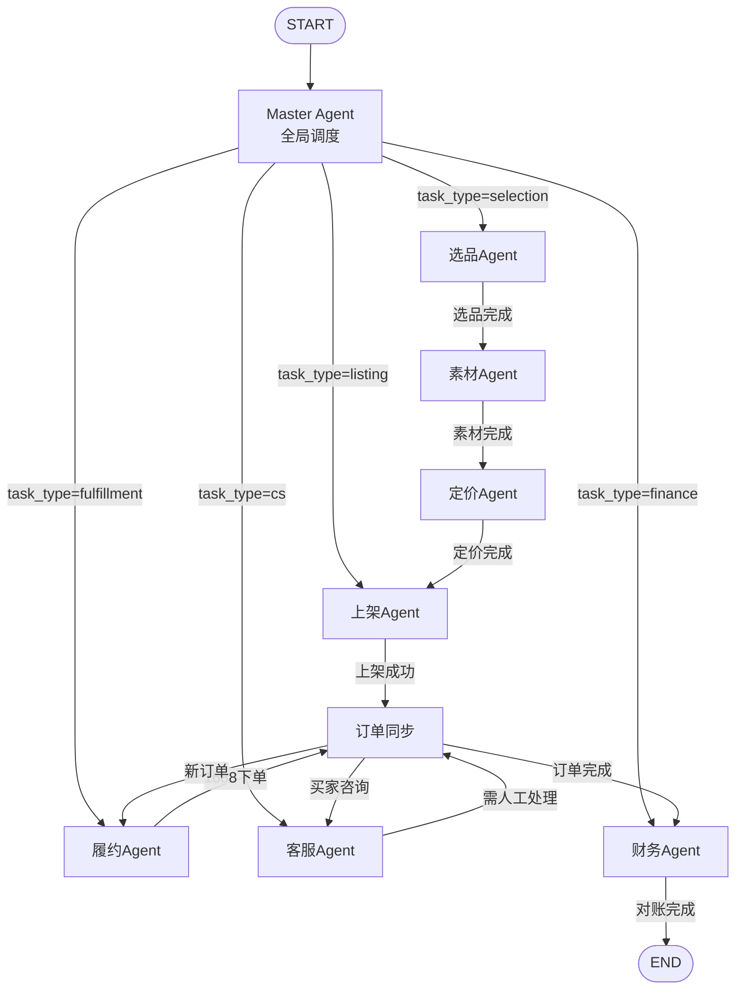
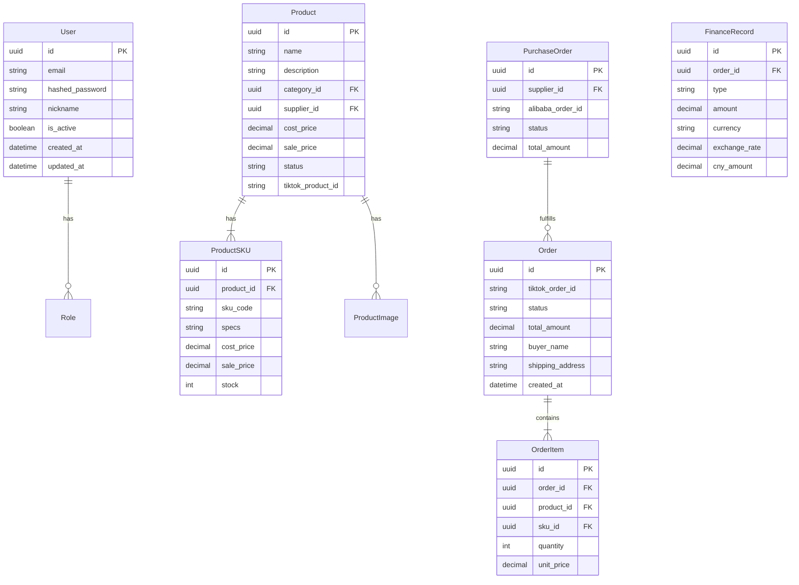
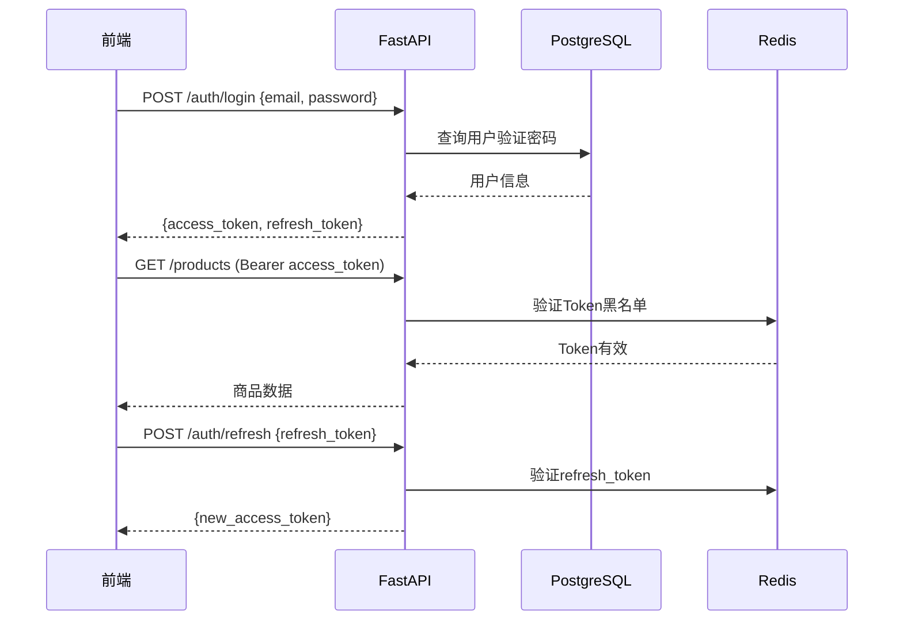

# TikTok跨境电商全自动运营系统 - 系统架构设计文档

> 版本: v1.0.0
> 更新日期: 2026-04-02

---

## 1. 系统概述

TikTok跨境电商全自动运营系统是一套覆盖"1688选品 → AI素材生成 → 智能定价 → TikTok Shop上架 → 订单履约 → AI客服 → 财务对账"完整业务链路的自动化运营平台。系统通过LangGraph编排多个AI Agent协同工作，实现跨境电商运营的核心环节自动化，大幅降低人工成本、提高运营效率。

---

## 2. 技术栈

| 层级 | 技术 | 版本 | 用途 |
|------|------|------|------|
| 后端框架 | FastAPI | 0.110+ | RESTful API服务 |
| ORM | SQLAlchemy | 2.0+ | 数据库ORM |
| 数据库迁移 | Alembic | 1.13+ | Schema版本管理 |
| 异步任务 | Celery | 5.3+ | 爬虫/素材生成等耗时任务 |
| Agent编排 | LangGraph | 0.2+ | 多Agent工作流编排 |
| LLM框架 | LangChain | 0.2+ | Agent工具链封装 |
| 数据库 | PostgreSQL | 15+ | 主数据存储 |
| 缓存 | Redis | 7+ | 会话缓存/热数据/消息队列 |
| 对象存储 | MinIO | Latest | 图片/素材文件存储 |
| 消息队列 | RabbitMQ | 3.13+ | Celery Broker |
| 爬虫框架 | Scrapy | 2.11+ | 1688商品数据采集 |
| 前端框架 | Vue 3 | 3.4+ | 管理后台UI |
| UI组件库 | Element Plus | 2.8+ | Vue3组件库 |
| 状态管理 | Pinia | 2.2+ | 前端状态管理 |
| 构建工具 | Vite | 5.4+ | 前端构建 |
| 容器 | Docker Compose | - | 开发环境编排 |
| CI/CD | GitHub Actions | - | 持续集成/部署 |

---

## 3. 整体架构

```mermaid
graph TB
    subgraph "Docker Compose 开发环境"
        subgraph "应用层"
            API[FastAPI 后端服务<br/>:8000]
            AGT[LangGraph Agent服务<br/>:8001]
            SCR[Scrapy 爬虫服务<br/>Celery Worker]
            FE[Vue3 管理后台<br/>:3000]
        end
        subgraph "基础设施"
            PG[(PostgreSQL 15<br/>:5432)]
            RD[(Redis 7<br/>:6379)]
            MN[(MinIO<br/>:9000)]
            RMQ[RabbitMQ<br/>:5672)]
        end
    end

    FE -->|HTTP| API
    API -->|SQLAlchemy| PG
    API -->|缓存/会话| RD
    API -->|文件存储| MN
    AGT -->|HTTP调用| API
    AGT -->|状态缓存| RD
    SCR -->|写入| PG
    SCR -->|Celery| RMQ
    API -->|Celery| RMQ
```

---

## 4. 模块化单体设计

后端采用模块化单体架构（Modular Monolith），在同一个FastAPI应用内按业务域拆分为独立Python包，模块间通过Service层接口通信，预留微服务拆分能力。

### 模块划分

| 模块 | 路径 | 职责 |
|------|------|------|
| product | `app/services/product_service.py` | 商品/SKU/类目/素材管理 |
| order | `app/services/order_service.py` | 订单CRUD/状态机 |
| fulfillment | `app/services/fulfillment_service.py` | 履约/1688采购/物流 |
| pricing | `app/services/pricing_service.py` | 成本核算/定价建议/汇率 |
| listing | `app/services/listing_service.py` | TikTok上架/类目匹配 |
| customer_service | `app/services/cs_service.py` | AI客服/话术/工单 |
| finance | `app/services/finance_service.py` | 财务对账/收入统计/利润 |
| auth | `app/core/security.py` | JWT认证/权限校验 |

### 模块通信原则

1. 模块间通过Service层方法调用，禁止直接跨模块访问Repository
2. 事件驱动的异步通信通过Celery Task实现（如订单创建触发采购单生成）
3. 模块数据库表通过外键关联，但不允许跨模块的join查询（为未来拆分做准备）

---

## 5. Agent编排架构

基于LangGraph构建多Agent协作系统，通过StateGraph定义工作流，条件路由实现Agent间调度。

### 工作流设计



### Agent职责

| Agent | 文件 | 职责 |
|-------|------|------|
| Master | `agents/master.py` | 全局调度，根据任务类型路由到业务Agent |
| Selection | `agents/selection.py` | 1688商品搜索、评分、选品池管理 |
| Material | `agents/material.py` | AI标题/描述生成、图片优化 |
| Pricing | `agents/pricing.py` | 成本核算、定价建议、汇率管理 |
| Listing | `agents/listing.py` | TikTok类目匹配、商品上架 |
| Fulfillment | `agents/fulfillment.py` | 1688采购、物流跟踪、发货管理 |
| CustomerService | `agents/customer_service.py` | AI自动应答、话术匹配、工单创建 |
| Finance | `agents/finance.py` | 收入统计、成本对账、利润报表 |

### Agent通信

Agent间通过LangGraph的State对象传递数据。State定义如下：

```python
class AgentState(TypedDict):
    task_type: str                    # selection/listing/fulfillment/cs/finance
    product_data: dict                # 商品数据
    material_data: dict               # 素材数据
    pricing_data: dict                # 定价数据
    listing_result: dict              # 上架结果
    order_data: dict                  # 订单数据
    fulfillment_data: dict            # 履约数据
    messages: list[BaseMessage]       # Agent间通信消息
    current_agent: str                # 当前执行的Agent
    error: str                        # 错误信息
```

---

## 6. 数据架构

### 核心实体关系



### 核心表清单

| 表名 | 用途 | 预计数据量 |
|------|------|-----------|
| users | 用户账号 | <100 |
| roles | 角色定义 | <10 |
| products | 商品信息 | 1万-10万 |
| product_skus | SKU规格 | 5万-50万 |
| product_images | 商品图片 | 10万-100万 |
| categories | 商品类目 | <1000 |
| suppliers | 供应商 | <1万 |
| orders | TikTok订单 | 10万-100万/月 |
| order_items | 订单明细 | 10万-100万/月 |
| purchase_orders | 1688采购单 | 1万-10万/月 |
| shipments | 物流信息 | 1万-10万/月 |
| finance_records | 财务记录 | 10万-100万/月 |
| cs_sessions | 客服会话 | 1万-10万/月 |
| cs_messages | 客服消息 | 10万-100万/月 |
| tickets | 工单 | 1000-1万/月 |
| exchange_rates | 汇率记录 | <1万 |

---

## 7. API设计

### 设计原则

1. RESTful风格，资源用名词复数表示
2. 版本控制：URL路径 `/api/v1/`
3. 统一响应格式

### 统一响应格式

**成功响应：**
```json
{
  "code": 0,
  "message": "success",
  "data": { ... }
}
```

**分页响应：**
```json
{
  "code": 0,
  "message": "success",
  "data": {
    "items": [...],
    "total": 100,
    "page": 1,
    "page_size": 20
  }
}
```

**错误响应：**
```json
{
  "code": 40001,
  "message": "商品不存在",
  "detail": "Product with id xxx not found"
}
```

### API端点总览

| 方法 | 路径 | 说明 |
|------|------|------|
| POST | /v1/auth/login | 用户登录 |
| POST | /v1/auth/register | 用户注册 |
| POST | /v1/auth/refresh | Token刷新 |
| GET | /v1/auth/me | 当前用户信息 |
| GET | /v1/products | 商品列表 |
| POST | /v1/products | 创建商品 |
| GET | /v1/products/{id} | 商品详情 |
| PUT | /v1/products/{id} | 更新商品 |
| POST | /v1/products/{id}/materials | 生成素材 |
| POST | /v1/products/{id}/listing | 上架到TikTok |
| GET | /v1/orders | 订单列表 |
| GET | /v1/orders/{id} | 订单详情 |
| PUT | /v1/orders/{id}/status | 更新订单状态 |
| POST | /v1/pricing/calculate | 成本核算 |
| GET | /v1/pricing/suggestions | 定价建议 |
| GET | /v1/fulfillment/purchase-orders | 采购单列表 |
| POST | /v1/fulfillment/purchase-orders | 创建采购单 |
| GET | /v1/fulfillment/shipments | 物流列表 |
| GET | /v1/customer-service/sessions | 客服会话列表 |
| GET | /v1/finance/summary | 财务概览 |
| GET | /v1/finance/transactions | 交易流水 |
| GET | /v1/health | 健康检查 |

---

## 8. 安全设计

### JWT认证流程



### RBAC权限模型

系统预设四种角色，每种角色对应不同的API访问权限：

| 角色 | 描述 | 权限范围 |
|------|------|---------|
| admin | 管理员 | 全部API + 用户管理 + 系统配置 |
| operator | 运营人员 | 商品/订单/履约/定价/上架 |
| cs_agent | 客服人员 | 客服会话/工单 |
| finance | 财务人员 | 财务报表/对账/汇率 |

### API限流

- 全局限流：60次/分钟/IP
- 登录接口：5次/分钟/IP
- 文件上传：10次/分钟/用户

---

## 9. 部署架构

### 开发环境（Docker Compose）

所有服务通过 `docker compose up` 一键启动，包含：
- PostgreSQL 15（持久化卷）
- Redis 7（持久化卷）
- MinIO（持久化卷）
- RabbitMQ（持久化卷）
- FastAPI后端（热重载）
- LangGraph Agent（热重载）
- Scrapy Worker
- Vue3前端（热重载）

### 生产环境演进路径

1. Phase 1 (MVP)：Docker Compose单机部署
2. Phase 2：引入Nginx反向代理 + SSL证书
3. Phase 3：按需拆分为微服务，引入K8s编排

---

## 10. Mock策略

TikTok Shop和1688 API在权限未就绪前，全部使用Mock Server模拟：

### Mock方案

1. **FastAPI Mock路由**：在对应API模块中添加Mock模式分支
2. **环境变量控制**：`TIKTOK_SHOP_MOCK_MODE=true` / `ALIBABA_1688_MOCK_MODE=true`
3. **Mock数据**：使用Faker生成逼真的模拟数据
4. **接口契约一致**：Mock响应结构与真实API完全一致，切换时零代码改动

### Mock覆盖范围

- TikTok Shop: 商品上架、订单查询、物流更新
- 1688: 商品搜索、商品详情、采购下单、物流查询
